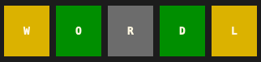
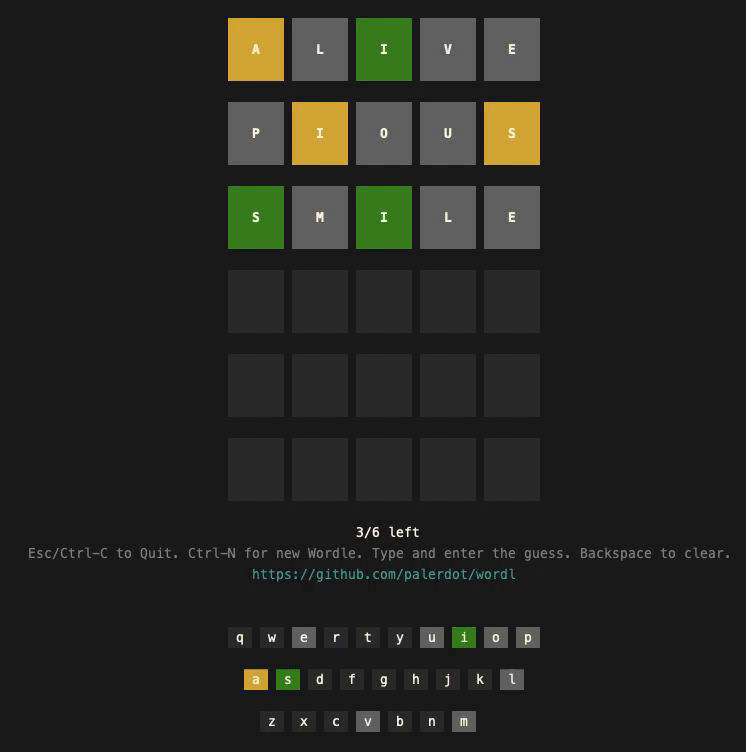

<p align="center">
  
</p>

Terminal Wordle.

**WORDL** aims to provide web like `Wordle` experience in the terminal, mainly
- `Slow Reveal` letter colors after guessing.
- Keyboard Hints




### Installation

```
go install github.com/palerdot/wordl@latest
```

`Go` version `1.16`+ is required.

You can also build from source if you have `Go` installed.

```
git clone https://github.com/palerdot/wordl
go build .
./wordl
```


